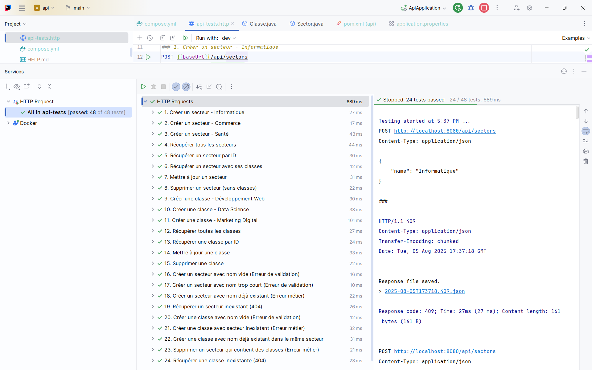

# Projet API Spring Boot - Gestion des Classes et Secteurs

Cette API permet de gérer un système éducatif avec une relation hiérarchique entre **Secteurs** et **Classes**. Chaque classe appartient à un secteur spécifique, avec des contraintes de validation et règles métier strictes.

## Table des matières

- [Fonctionnalités principales](#fonctionnalités-principales)
- [Technologies utilisées](#technologies-utilisées)
- [Endpoints API](#endpoints-api)
- [Démarrage rapide](#démarrage-rapide)
- [Tests inclus](#tests-inclus)
- [Exemples d'utilisation](#exemples-dutilisation)

## Fonctionnalités principales

- **CRUD complet** pour Secteurs et Classes
- **Validation** avec Bean Validation
- **DTOs et mappers** avec MapStruct
- **Gestion d'erreurs** centralisée et structurée
- **Documentation API** avec Swagger UI
- **Tests HTTP** prêts à l'emploi
- **Base de données** MySQL avec Docker Compose

## Technologies utilisées

| Technologie         | Version | Usage                   |
| ------------------- | ------- | ----------------------- |
| **Java**            | 17      | Langage principal       |
| **Spring Boot**     | 3.5.4   | Framework web           |
| **Maven**           | 3.9.11  | Gestion des dépendances |
| **MySQL**           | 8.0     | Base de données         |
| **MapStruct**       | 1.6.3   | Mapping DTO/Entity      |
| **Swagger**         | 2.8.9   | Documentation API       |
| **Docker**          | -       | Conteneurisation BDD    |

## Endpoints API

L'application expose une API REST permettant de gérer une entité.

> **[Accéder à Swagger](http://localhost:8080/swagger-ui/index.html)**

### Secteurs

- `GET /api/sectors` - Liste tous les secteurs
- `POST /api/sectors` - Créer un secteur
- `PUT /api/sectors/{id}` - Modifier un secteur
- `DELETE /api/sectors/{id}` - Supprimer un secteur

### Classes

- `GET /api/classes` - Liste toutes les classes
- `POST /api/classes` - Créer une classe
- `PUT /api/classes/{id}` - Modifier une classe
- `DELETE /api/classes/{id}` - Supprimer une classe

## Démarrage rapide

### 1. Base de données (Docker)

```bash
docker-compose up -d
```

### 2. Démarrer l'application

```bash
mvn clean compile
mvn spring-boot:run
```

### 3. Accéder aux interfaces

- **API** : http://localhost:8080
- **Swagger UI** : http://localhost:8080/swagger-ui.html
- **PhpMyAdmin** : http://localhost:81

### 4. Gestion de la base de données avec PhpMyAdmin

Une fois Docker Compose démarré, vous pouvez accéder à l'interface web PhpMyAdmin pour gérer votre base de données :

- **URL** : http://localhost:81
- **Utilisateur** : `admin`
- **Mot de passe** : `passer`
- **Base de données** : `exam_db`

## Tests inclus

Le projet contient un fichier `api-tests.http` avec :

- Tests CRUD complets
- Validation des erreurs (400, 404, 409)
- Règles métier (unicité, intégrité référentielle)
- Scénarios edge cases

### Interface de tests HTTP

  
_Fichier de tests HTTP avec 24 scénarios couvrant tous les cas d'usage de l'API_

## Exemples d'utilisation

### Créer un secteur

```http
POST /api/sectors
{
    "name": "Informatique"
}
```

### Créer une classe

```http
POST /api/classes
{
    "className": "Développement Web",
    "description": "Formation technologies web modernes",
    "sectorId": 1
}
```
